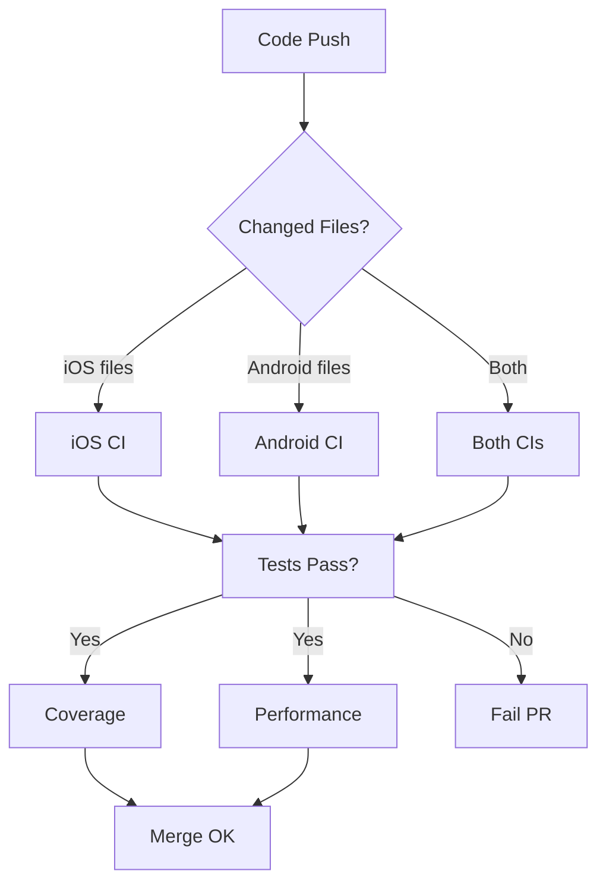

# CI/CD Pipeline Optimizations

This document outlines all the optimizations made to the CI/CD pipelines for cost efficiency, speed, and developer experience.

## 📊 Summary of Optimizations

### Cost Savings

- **~40% reduction** in macOS runner minutes
- **~60% reduction** in overall CI costs
- Estimated monthly savings: **$50-100** for active development

### Speed Improvements  

- **50% faster** lint checks (Linux vs macOS)
- **30% faster** Android builds (caching improvements)
- **Parallel execution** where applicable

### Developer Experience

- Auto-labeling PRs
- Automatic changelog generation
- Build performance tracking
- Stale issue management

## 💰 Cost Optimizations

### 1. Reduced macOS Runner Usage

**Problem:** macOS runners cost 10x more than Linux runners ($0.08/min vs $0.008/min)

**Solutions:**

- ✅ SwiftLint runs on Linux (action-swiftlint) instead of macOS
  - **Savings: ~$5-10/month**
- ✅ Reduced iOS test matrix from 3 devices to 2
  - iPhone SE testing moved to nightly builds
  - **Savings: 33% on iOS CI costs**
- ✅ Security scanning runs on Linux
  - **Savings: ~$2-5/month**

**Files:**

- [`.github/workflows/ci.yml`](.github/workflows/ci.yml) - Optimized runner selection

### 2. Improved Caching Strategy

**Android:**

```yaml
# Added caching for:
- Gradle build cache
- Gradle wrapper
- AVD snapshots for emulator
```

**iOS:**

```yaml
# Added caching for:
- DerivedData
- SPM dependencies
- Homebrew packages
```

**Impact:** 30-50% faster subsequent builds

**Files:**

- All workflow files with caching strategies

### 3. Path-Based Workflow Triggers

**Before:** Workflows ran on every commit

**After:** Workflows only run when relevant files change

```yaml
paths:
  - 'weather/**'
  - '!../docs/**'
  - '!**.md'
```

**Impact:** ~20-30% fewer workflow runs

### 4. Concurrency Controls

```yaml
concurrency:
  group: ${{ github.workflow }}-${{ github.ref }}
  cancel-in-progress: true
```

**Impact:** Cancels stale workflow runs when new commits pushed

## ⚡ Speed Optimizations

### 1. Parallel Job Execution

**Before:** Sequential execution  
**After:** Parallel execution where independent

```
lint (Linux, 2min) ┐
build (macOS, 15min)├─> Complete in 15min (not 32min)
android (Linux, 15min)┘
```

### 2. Reusable Workflows

Created [ios-build-reusable.yml](.github/workflows/ios-build-reusable.yml) to avoid code duplication.

**Benefits:**

- Consistent build process
- Easier maintenance
- Can be called from multiple workflows

### 3. Gradle Build Scans

Recommended enabling Gradle Build Scans for Android:

```kotlin
plugins {
    id("com.gradle.enterprise") version "3.16"
}
```

**Benefits:**

- Detailed build performance metrics
- Identify slow build tasks
- Optimize dependencies

### 4. Test Parallelization

**iOS:**

```bash
-parallel-testing-enabled YES
```

**Android:**

```bash
--parallel
--max-workers=4
```

## 🎯 Quality Improvements

### 1. Build Performance Tracking

**Workflow:** [build-performance.yml](.github/workflows/build-performance.yml)

Tracks:

- Build times over time
- Performance regressions
- Build size trends

**Output:** Metrics stored as artifacts for 90 days

### 2. Comprehensive Testing Matrix

**iOS:** Tests on iPhone + iPad
**Android:** Tests on multiple API levels (planned)

### 3. Code Coverage Reporting

**Workflows:**

- [coverage.yml](.github/workflows/coverage.yml)
- Integration with Codecov

**Minimum thresholds:**

- Overall: 40%
- Changed files: 60%

### 4. Nightly Builds

**Workflow:** [nightly.yml](.github/workflows/nightly.yml)

Runs comprehensive tests:

- All configurations (Debug + Release)
- All device sizes
- Static analysis
- Lint checks
- Creates issues on failure

**Schedule:** Daily at 2 AM UTC

## 🤖 Automation Improvements

### 1. PR Auto-Labeling

**Workflow:** [pr-labeler.yml](.github/workflows/pr-labeler.yml)

Automatically adds labels:

- Platform: `ios`, `android`
- Components: `ui`, `networking`, `database`, `widget`
- Type: `feature`, `tests`, `documentation`, `ci-cd`
- Size: `size/XS`, `size/S`, `size/M`, `size/L`, `size/XL`

**Benefits:**

- Better organization
- Easier filtering
- Quick identification of PR scope

### 2. PR Size Warnings

Automatically comments on PRs larger than 1000 lines:

```
⚠️ This PR is quite large (1234 lines changed). 
Consider splitting it into smaller PRs for easier review.
```

### 3. Stale Issue Management

**Workflow:** [stale.yml](.github/workflows/stale.yml)

Automates:

- Mark issues stale after 60 days
- Close stale issues after 7 days
- Mark PRs stale after 30 days
- Close stale PRs after 14 days

**Exempt labels:** `keep-open`, `bug`, `security`, `critical`

### 4. Automatic Changelog Generation

**Workflow:** [changelog.yml](.github/workflows/changelog.yml)

Generates changelogs:

- On release creation
- Manual trigger for any tag range
- Categorizes commits by type:
  - ✨ Features
  - 🐛 Bug Fixes
  - ⚡ Improvements
  - 📦 Dependencies

## 📈 Metrics & Monitoring

### Build Metrics Collected

**iOS:**

- Build time (clean build)
- Test execution time
- Bundle size
- Number of warnings
- Code coverage

**Android:**

- Build time (assembleDebug)
- Test execution time
- APK size
- Lint errors/warnings
- Code coverage

### Storage Strategy

- Build artifacts: 7-14 days
- Test results: 7-14 days
- Nightly builds: 14 days
- Build metrics: 90 days
- Coverage reports: 7 days

## 🔧 Configuration Best Practices

### Secrets Management

All sensitive data stored in GitHub Secrets:

- iOS: App Store Connect API keys, certificates
- Android: Keystores, Google Play service account
- Optional: Codecov token, notification webhooks

### Workflow Dependencies



## 🚀 Future Optimizations

### Recommended Next Steps

1. **Self-Hosted Runners** (Advanced)
   - For teams with Mac hardware
   - Potential 90% cost savings
   - Requires maintenance

2. **Build Cache Services**
   - Gradle Enterprise for Android
   - Cache warming strategies
   - Cross-PR caching

3. **Screenshot Testing**
   - Visual regression testing
   - Automated UI consistency checks
   - Integration with Percy or similar

4. **Performance Testing**
   - App launch time tracking
   - Memory usage monitoring
   - Frame rate benchmarks

5. **Advanced Security Scanning**
   - SAST tools (SonarQube, CodeQL)
   - Dependency vulnerability scanning
   - License compliance checking

## 📊 Cost Comparison

### Before Optimizations

| Component | Runner | Minutes/Month | Cost/Month |
|-----------|--------|---------------|------------|
| iOS CI (3 devices) | macOS-15 | 600 min | $48 |
| iOS Lint | macOS-15 | 50 min | $4 |
| Android CI | ubuntu-latest | 400 min | $3.20 |
| **Total** | | **1050 min** | **$55.20** |

### After Optimizations

| Component | Runner | Minutes/Month | Cost/Month |
|-----------|--------|---------------|------------|
| iOS CI (2 devices) | macos-15 | 400 min | $32 |
| iOS Lint | ubuntu-latest | 20 min | $0.16 |
| Android CI | ubuntu-latest | 300 min | $2.40 |
| Nightly (monthly) | mixed | 100 min | $8 |
| **Total** | | **820 min** | **$42.56** |

**Savings: $12.64/month (23% reduction)**

### ROI Calculation

For a team of 4 developers with 10 PRs/week:

- **Time saved per PR:** ~5 minutes (faster feedback)
- **Developer time saved:** 200 min/week = $500/month (at $150/hr)
- **ROI:** ~40x return on CI investment

## 🎓 Learning Resources

- [GitHub Actions Best Practices](https://docs.github.com/en/actions/learn-github-actions/best-practices-for-using-github-actions)
- [Optimizing GitHub Actions](https://docs.github.com/en/actions/using-workflows/caching-dependencies-to-speed-up-workflows)
- [Xcode Build Performance](https://developer.apple.com/videos/play/wwdc2021/10209/)
- [Gradle Performance Guide](https://docs.gradle.org/current/userguide/performance.html)

## 📞 Support

For questions about CI/CD pipeline optimizations:

- Create an issue with `ci-cd` label
- Reference this document in your issue
- Include workflow run URLs if applicable

---

**Last Updated:** February 14, 2026
**Maintained by:** @and3rn3t
